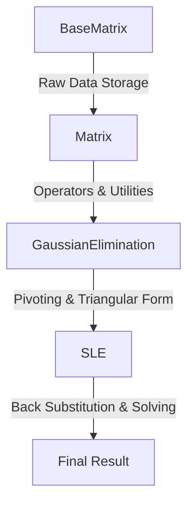
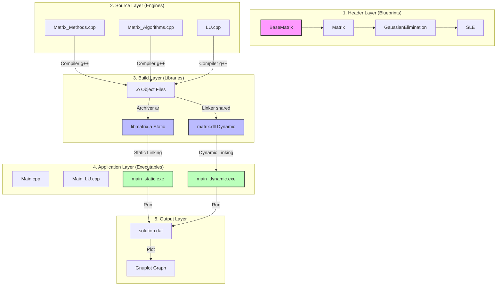

# Matrix Project - Lab Overview & Explanation

This document provides a full breakdown of the `Matrix1` folder, the source code logic, and how the automation scripts work.

---

## 1. Folder Structure - "Where is everything?"

- **`Include/`**: Contains the "blueprints" (header files `.hpp`).
    - `Matrix.hpp`: Definitions for `BaseMatrix` and `Matrix` classes.
    - `gauss_elimination.hpp`: Definitions for the `GaussianElimination` class.
    - `SLE.hpp`: Definitions for the `SLE` (System of Linear Equations) class.
    - `LU.hpp`: Definitions for the LU Decomposition class.
- **`Src/`**: Contains the "engines" (source files `.cpp`).
    - `Matrix_Methods.cpp`: Constructors and basic operations (addition, printing).
    - `Matrix_Algorithms.cpp`: The math algorithms (pivoting, Gaussian, Inverses).
    - `LU.cpp`: The LU Decomposition implementation.
- **`Large_Matrix/`**: Folder containing `.txt` files with matrix data (e.g., 225x225 systems).
- **Libraries**:
    - `libmatrix.a`: The **Static Library**. It’s the pre-compiled version of your code.
    - `matrix.dll`: The **Dynamic Library**. Shared code that runs alongside your program.
- **Root Files**:
    - `Main.cpp`: Uses `SLE` class to solve systems using Gaussian Elimination.
    - `Main_LU.cpp`: Uses `LU` class to solve systems using Doolittle/Crout/Cholesky.
    - `run_matrix.bat`: The automation script for building and running on Windows.

---

## 2. Code Logic: The OOP Hierarchy

The code follows **Inheritance**, meaning a child class "gets" everything from its parent and adds more features.

1.  **`BaseMatrix`**: Handles the storage. It uses `std::vector<std::vector<long double>>` to store numbers with high precision.
2.  **`Matrix`**: Adds math. It overloads symbols like `+` and `*` and provides property checks like `isSymmetric()`.
3.  **`GaussianElimination`**: Adds the "Triangular" logic. It uses **Partial Pivoting** to move the largest number into the pivot position, making the math more accurate and preventing division by zero.
4.  **`SLE`**: The final step. It solves for the variables ($x$) using **Back-Substitution**.

---

## 3. C++ OOP Concepts in your Code

This project is a perfect example of modern Object-Oriented Programming (OOP):

### 1. Encapsulation (Hiding Complexity)
We keep the raw matrix data (`mat`) **protected**. This means the user can't accidentally break the internal math. We also used a **Friend Class** (`LU`), allowing it special access to be faster without exposing everything to the public.

### 2. Inheritance (Organization)
The class hierarchy follows a logical progression. You start with a basic matrix and "evolve" it into a system solver. Each child class (`GaussianElimination`, `SLE`) automatically gets all the features of its parent.

### 3. Abstraction (Simplicity)
In `Main.cpp`, you don't care how the matrix swaps rows or calculates ratios. You just call `solveWithPivot()`. The messy details are "abstracted away" inside the logic of the class.

### 4. Polymorphism (Flexibility)
- **Functions Overloading**: We have multiple constructors (empty, sized, or copy).
- **Virtual Functions**: Methods like `upperTriangularWithoutPivot()` are marked `virtual`. This tells C++ to "look up" the correct version of the function if we use a pointer.

---

## 4. Build Architecture: Compile-time vs Run-time

### Compile-time (Before you run)
- When you run `make`, the compiler checks for typos.
- **Operator Overloading**: The compiler decides exactly which math logic to use for `A + B`.
- **Static Linking**: When building `main_static.exe`, all code from `libmatrix.a` is copied inside.

### Run-time (While the code is running)
- **Dynamic Linking**: When you run `main_dynamic.exe`, it searches your folder for `matrix.dll` to find the math logic.
- **Virtual Dispatch**: If you had a list of different Matrix types, C++ would use its "vTable" (Virtual Table) at run-time to find the correct method to execute.

---

## 5. Build Tools & Automation

To make life easier during your lab, we have two main tools that handle the "heavy lifting" of compilation:

### 1. The `makefile` (The Coordinator)
A `makefile` is like a recipe for your project. It tells the computer how to build the library and executables step-by-step.
- **Variables**: It defines `CC = g++` (the compiler) and `CFLAGS` (the rules, like `-std=c++17`).
- **Object Files**: It first turns your `.cpp` files into `.o` (object files). This is faster because if you only change one file, the compiler only has to re-build that one.
- **Library Rules**: 
    - `static`: Uses `ar rcs` to package object files into `libmatrix.a`.
    - `dynamic`: Uses `g++ -shared` to create `matrix.dll`.
- **Linking**: It connects your `Main.cpp` to the library using `-L.` (look in this folder) and `-lmatrix` (use the matrix library).

### 2. The `run_matrix.bat` (The Automation Script)
This is a Windows-specific script that wraps the complex `g++` commands into a simple menu.
- **The Wrapper**: Instead of you typing a 50-character command, you just press "1" or "3".
- **Self-Healing**: It checks if your `g++` compiler is installed (`where g++`) and warns you if it's missing.
- **Logic Flow**:
    - **Selection**: It uses `set /p` to ask for your choice and `if` statements to jump (`goto`) to the correct command.
    - **Dependency Check**: For example, if you try to run the code but haven't built the library yet, the script is smart enough to detect it and build the library for you automatically.
    - **Cleaning**: It uses a PowerShell command to safely remove old build files, ensuring you always have a "clean" run without leftovers from previous attempts.

---

## 6. Why this matters for your Lab

- **Precision**: We use `long double` (12 or 16 bytes) instead of `double` (8 bytes). This prevents "rounding errors" on 225x225 matrices.
- **Modularity**: If you need to fix the Gaussian formula, you only change `Matrix_Algorithms.cpp`. The rest of the library stays the same.
- **Speed**: LU Decomposition is pre-compiled, making it much faster when solving for multiple different result vectors.

---

### How to use during Lib:
1. Open PowerShell in this folder.
2. Run `./run_matrix.bat`.
3. Select **Option 3** for standard Gaussian solving.
4. Select **Option 4** for LU solving (best for the 225x225 matrices).

---

## 7. Full System Hierarchy & Flow Diagram

Here is the complete visualization of your project's architecture:

### Flow Breakdown:
1.  **Definitions**: Headers in `Include/` define the class structures.
2.  **Implementation**: Source files in `Src/` contain the logic.
3.  **Compilation**: `makefile` or `run_matrix.bat` compiles the source into a library.
4.  **Linking**: Your main programs combine with the library to create tools like `main_static.exe`.
5.  **Execution**: You run the executable, it reads data from `Large_Matrix/`, solves it, and saves the final graph data.
